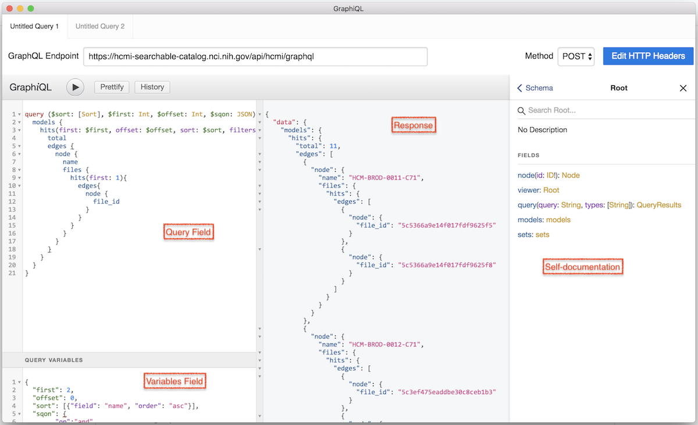

# Introduction

The HCMI Searchable Catalog was built with an extensive API allowing programmatic access to any data currently available through the user interface. The purpose of this documentation it to provide initial elements to start exploring HCMI data through its available APIs:

* A GraphQL API supporting search and exploration features
* A REST API providing HCMI-specific business logic

# Discover GraphQL

The HCMI GraphQL endpoint, available at `https://hcmi-searchable-catalog.nci.nih.gov/api/hcmi/graphql` is a standard GraphQL implementation. Detailed GraphQL documentation and resources are available on [GraphQL official website](https://graphql.org/learn/).

## Install and start GraphiQL electron app

The [Graphiql electron app](https://electronjs.org/apps/graphiql) provides a simple user interface to start querying the catalog GraphQL API. 

Once the application is installed, joint specify `https://hcmi-searchable-catalog.nci.nih.gov/api/hcmi/graphql` in the `GraphQL Endpoint` field.

This documentation will contain sample queries, you are encouraged to copy those into Graphiql and start exploring the data.




## Sample Query

In this first sample, we'll be requesting the first 5 cancer models, sorted by name as well as the total count of models available.

INSERT SCREENSHOT

GraphQL Query
```graphQL
query ($sort: [Sort], $first: Int, $offset: Int, $sqon: JSON) {
  models {
    hits(first: $first, offset: $offset, sort: $sort, filters: $sqon) {
      total
      edges {
        node {
          name
        }
      }
    }
  }  
}
```

Variables
```json
{"first": 5, "offset": 0, "sort": [{"field": "name", "order": "asc"}]}
```

Results
```json
{
  "data": {
    "models": {
      "hits": {
        "total": 15,
        "edges": [
          {
            "node": {
              "name": "HCM-BROD-0003-C71"
            }
          },
          {
            "node": {
              "name": "HCM-BROD-0011-C71"
            }
          },
          {
            "node": {
              "name": "HCM-BROD-0012-C71"
            }
          },
          {
            "node": {
              "name": "HCM-BROD-0014-C71"
            }
          },
          {
            "node": {
              "name": "HCM-BROD-0028-C71"
            }
          }
        ]
      }
    }
  }
}
```

You could request the next 5 results, by setting the value of `offset` to 5, allowing you to [paginate through the results](https://graphql.org/learn/pagination/).

## GraphQL Introspection

GraphQL supports [introspection](https://graphql.org/learn/introspection/). Using the `Docs` menu of GraphiQL, you can navigate through the schema and understand how to build queries.

Auto-completion is also provided by GraphiQL, with auto-suggestion of available fields. The entire model and its mapping can also be obtained by executing the following query:
```graphql
query{
  models {
    mapping
    extended
  }
}
```

## Learn more

The HCMI Catalog user interface uses GraphQL to fetch data, using your browser's developer tools, you can inspect calls and look at how the portal is building its graphql calls

# REST endpoints

HCMI rest endpoint have their dedicated documentation available here: https://hcmi-searchable-catalog.nci.nih.gov/api/docs#

# Sample App using both GraphQL and Rest

Let's imagine we want to build a web app displaying a gallery view of all models with images. 

```graphql
query ($sort: [Sort], $first: Int, $offset: Int, $sqon: JSON) {
  models {
    hits(first: $first, offset: $offset, sort: $sort, filters: $sqon) {
      total
      edges {
        node {
          name
          files {
	  hits(first: 1){
              edges{
                node {
                  file_id          
                }
              }
            }
          }
        }
      }
    }
  }  
}
```

Variables
```json
{
  "first": 2, 
  "offset": 0, 
  "sort": [{"field": "name", "order": "asc"}], 
  "sqon":{
        "op":"and",
        "content":[
          {
            "op":"in",
            "content":{
              "field":"files.file_type",
              "value":["image/jpeg"]
            }
          }
        ]
      }
}
```

Result
```json
{
  "data": {
    "models": {
      "hits": {
        "total": 11,
        "edges": [
          {
            "node": {
              "name": "HCM-BROD-0011-C71",
              "files": {
                "hits": {
                  "edges": [
                    {
                      "node": {
                        "file_id": "5c5366a9e14f017fdf9625f5"
                      }
                    },
                    {
                      "node": {
                        "file_id": "5c5366a9e14f017fdf9625f8"
                      }
                    }
                  ]
                }
              }
            }
          },
          {
            "node": {
              "name": "HCM-BROD-0012-C71",
              "files": {
                "hits": {
                  "edges": [
                    {
                      "node": {
                        "file_id": "5c3ef475eaddbe30c8ceb1b3"
                      }
                    },
                    {
                      "node": {
                        "file_id": "5c3ef48eeaddbe30c8ceb1b9"
                      }
                    }
                  ]
                }
              }
            }
          }
        ]
      }
    }
  }
}
```
